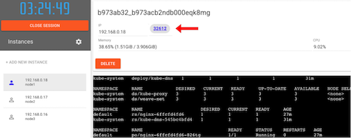

# Lab 3- Introduction to Orchestration

© Copyright IBM Corporation 2017

IBM, the IBM logo and ibm.com are trademarks of International Business Machines Corp., registered in many jurisdictions worldwide. Other product and service names might be trademarks of IBM or other companies. A current list of IBM trademarks is available on the Web at &quot;Copyright and trademark information&quot; at www.ibm.com/legal/copytrade.shtml.


This document is current as of the initial date of publication and may be changed by IBM at any time.

The information contained in these materials is provided for informational purposes only, and is provided AS IS without warranty of any kind, express or implied. IBM shall not be responsible for any damages arising out of the use of, or otherwise related to, these materials. Nothing contained in these materials is intended to, nor shall have the effect of, creating any warranties or representations from IBM or its suppliers or licensors, or altering the terms and conditions of the applicable license agreement governing the use of IBM software. References in these materials to IBM products, programs, or services do not imply that they will be available in all countries in which IBM operates. This information is based on current IBM product plans and strategy, which are subject to change by IBM without notice. Product release dates and/or capabilities referenced in these materials may change at any time at IBM&#39;s sole discretion based on market opportunities or other factors, and are not intended to be a commitment to future product or feature availability in any way.

# Overview

So far you have learned how to run applications using docker on your local machine, but what about running dockerized applications in production? There are a number of problems that come with building an application for production: scheduling services across distributed nodes, maintaining high availability, implementing reconciliation, scaling, and logging... just to name a few.

There are several orchestration solutions out there that help you solve some of these problems. One example is the [IBM Cloud Container Service](https://www.ibm.com/cloud-computing/bluemix/containers) which uses [Kubernetes](https://kubernetes.io/) to run containers in production. Docker Swarm is another solution for container orchestration, that comes built-in to the Docker Engine. For this lab, we will be introducing concepts of container orchestration using vanilla Kubernetes.

In this lab, we will be using http://play-with-k8s.com, a free online tool that will allow you to quickly create a Kubernetes cluster without installing an extra tools. Optionally, you may want to explore [minikube](https://kubernetes.io/docs/tasks/tools/install-minikube/) for a local installation of Kubernetes, or the [IBM Cloud Container Service](https://www.ibm.com/cloud-computing/bluemix/containers) for a hosted solution.

## Prerequisites

In order to complete a lab about deploying an application that is deployed across multiple hosts, we will be using http://play-with-k8s.com. This is the easiest way to test out Kubernetes, without having to install any additional tools on your workstation.

# Step 1: Create your first Kubernetes cluster

1. Navigate to http://play-with-k8s.com and use your Github or Docker ID to login. Proceed to the main dashboard page.

2. Click "add new instance" on the lefthand side three times to create three nodes

Our first Kubernetes cluster will have three nodes.

3. Initialize the master node (node1)
Copy the first step for bootstrapping the cluster into the terminal for node 1.
```sh
[node1 /]$ kubeadm init --apiserver-advertise-address $(hostname -i)
Initializing machine ID from random generator.
...
```

Wait a minute until the process to initialize the cluster finishes. When it finishes, you should see output that looks like this:
```sh
  kubeadm join --token 768017.3fe46b301dba4ce1 192.168.0.23:6443 --discovery-token-ca-cert-hash sha256:10d0c8cbca727e8988e50c94d4f330e9264166da6f0812e129cce50280967fb2
```
Take note of this output, we will be using that in the next step. But first, initialize networking for the cluster on node1. This was step 2 for the bootstrapping instructions displayed at the top of the console.

```sh
[node1 /]$ kubectl apply -n kube-system -f \
>     "https://cloud.weave.works/k8s/net?k8s-version=$(kubectl version | base64 |tr -d '\n')"
serviceaccount "weave-net" created
clusterrole "weave-net" created
clusterrolebinding "weave-net" created
role "weave-net" created
rolebinding "weave-net" created
daemonset "weave-net" created
```

4. Initialize the worker nodes (node2 and node3)
Copy the `kubeadm join` command from node1 into the consoles for node2 and node3.

On node2:
```sh
[node2 /]$ kubeadm join --token 768017.3fe46b301dba4ce1 192.168.0.23:6443 --discovery-token-ca-cert-hash sha256:10d0c8cbca727e8988e50c94d4f330e9264166da6f0812e129cce50280967fb2
Initializing machine ID from random generator
...
```

On node3:
```sh
[node3 /]$ kubeadm join --token 768017.3fe46b301dba4ce1 192.168.0.23:6443 --discovery-token-ca-cert-hash sha256:10d0c8cbca727e8988e50c94d4f330e9264166da6f0812e129cce50280967fb2
Initializing machine ID from random generator
```

4. Verify
Once this is complete, click back to node1. Run `kubectl get nodes` and you should see all three nodes in your cluster. If they are in the `NotReady` state, wait a few seconds, then try again. Don't move to the next step until all three nodes have a `Ready` status.
```sh
[node1 /]$ kubectl get nodes
NAME      STATUS    ROLES     AGE       VERSION
node1     Ready     master    2m        v1.8.4
node2     Ready     <none>    1m        v1.8.4
node3     Ready     <none>    1m        v1.8.4
```

You now have a three node Kubernetes cluster!

Our cluster consists of 1 master and 2 worker nodes. The master runs the API server that will handle commands and schedule workloads across the worker nodes in the cluster. For security reasons, masters will not run workloads themselves, but that is configurable.

All `kubectl` commands for the rest of this lab need to be executed directly on the master node (Node1).

**Note:** While in this lab we will control the Kubernetes cluster directly from the master in which its running, the more likely usecase is that you control your Kubernetes cluster remotely by connecting the `kubectl` CLI client to your cluster remotely. This will become useful when you want to control production applications remotely instead of ssh-ing directly into production servers.

# Step 2: Create a deployment 

Now that we have our 3 node Kubernetes cluster initialized, let's deploy some containers. To run containers on a Kubernetes cluster, we want to create a deployment. A deployment is a Kubernetes object that manages multiple instances of a container of the same image deployed across a distributed cluster.

Let's do a simple example using Nginx. For now we will create a deployment with just 1 running container, but we will scale up later.
 
1. Create a deployment using Nginx version 1.12

```sh
[node1 /]$ kubectl run nginx --image=nginx:1.12
deployment "nginx" created
```

This command will create a deployment using the [nginx:1.12](https://hub.docker.com/_/nginx/) image from DockerHub. Our Kubernetes cluster is automatically configured to pull images from DockerHub, but we can configure other image registries such as a private registry you configure yourself.

Verify your deployment by using `kubectl get deployments`.

```sh
[node1 /]$ kubectl get deployments
NAME      DESIRED   CURRENT   UP-TO-DATE   AVAILABLE   AGE
nginx     1         1         1            1           16s
```

Behind the scenes, the deployment will create additional objects called "pods". Pods are the lowest unit of abstraction in Kubernetes nomenclature. They usually correspond 1-1 with a running container, but there are usecases for using more than one container per pod. More common patterns for multiple containers per pod, check out this [blog post](http://blog.kubernetes.io/2015/06/the-distributed-system-toolkit-patterns.html).

Check out the pods that were created using `kubectl get pods`.

``sh
[node1 /]$ kubectl get pods
NAME                     READY     STATUS    RESTARTS   AGE
nginx-6ffcfd4fd6-826tg   1/1       Running   0          32s
``

You should see one running pod. It may take a few minutes for that status to be "running". The node will need to download the nginx image to the machine, before running it, similar to the first time you ran a Docker container in Lab 1.

You may notice a pattern using the `kubectl` CLI. So far we have used `kubectl get nodes`, `kubectl get deployments`, and `kubectl get pods`. You interact with Kubernetes by defining objects that you want to create. This objects are usually defined in a yaml file and passed to a `kubectl create` command, or in some cases can be created directly (such as when we ran `kubectl run` to create our deployment). Some objects, like the pods in our nginx deployment, are created and managed for us. While we can create these pod objects directly using `kubectl create` and passing in a yaml file for a pod definition, it usually makes sense to have kubernetes manage these lower level objects for us. For example, in the case of our deployment object, if the underlying pod goes down, our deployment object will automatically schedule a new pod in the cluster. For a full list of what objects you can define in Kubernetes, check out the official [Kubernetes API reference doc](https://kubernetes.io/docs/reference/).

This last statement sheds light on an important feature of Kubernetes, and almost all container orchestration platforms in general. The objects that you create are done in a *declarative* fashion. Once you create an object, such as a deployment object, Kubernetes will actively monitor the desired state of the cluster, and reconcile if the actual state does not match the desired state e.g. if a pod in a deployment goes down, it will schedule a new pod. We will see a demonstration of that a little later on in this lab.


# Step 3: Create a service

Now that we have a nginx deployment, let's expose it to the outside world using a Kubernetes service using the `kubectl expose` command.

```sh
[node1 /]$ kubectl expose deployment/nginx --type="NodePort" --port=80
service "nginx" exposed
```

Verify that your service was creating using `kubectl get service`.
```sh
[node1 /]$ kubectl get service
NAME         TYPE        CLUSTER-IP      EXTERNAL-IP   PORT(S)          AGE
kubernetes   ClusterIP   10.96.0.1       <none>        443/TCP          35m
nginx        NodePort    10.108.218.78   <none>        80:32612/TCP   1m
```

Defining a service creates a stable endpoint that provides load balancing in front of a set of pods. Service endpoints will remain stable through updating a deployment. They can be used to expose applications within a cluster to each other privately (using `--type="ClusterIP"`) as well as to the outside worlds using the `NodePort` and `LoadBalancer` types. If you have `kube-dns` installed (play-with-k8s.com has it installed by default), then you will also get a DNS entry created in the internal Kubernetes DNS that is available to other Pods running in the cluster. Go [here](https://kubernetes.io/docs/concepts/services-networking/service/) to learn more about services.

This command will create a link at the top of your screen in http://play-with-k8s.com. Click the link to access the nginx service.



# Step 4: Scale your app

Right now, our nginx deployment is only running one instance of our application. 

```sh
[node1 /]$ kubectl get deployment nginx
NAME      DESIRED   CURRENT   UP-TO-DATE   AVAILABLE   AGE
nginx     1         1         1            1           56m
```

Let's scale up so we can handle more traffic using `kubectl scale`.

```sh 
[node1 /]$ kubectl scale --replicas=10 deployment nginx
deployment "nginx" scaled
```

You can check the deployment with `kubectl get deployment` or `kubectl get pods`.

```sh
[node1 /]$ kubectl get deployment nginx
NAME      DESIRED   CURRENT   UP-TO-DATE   AVAILABLE   AGE
nginx     10        10        10           10          1h
[node1 /]$ kubectl get pods
NAME                        READY     STATUS    RESTARTS   AGE
nginx-6ffcfd4fd6-826tg      1/1       Running   0          1h
nginx-6ffcfd4fd6-85gtl      1/1       Running   0          36s
nginx-6ffcfd4fd6-92878      1/1       Running   0          36s
nginx-6ffcfd4fd6-92pxz      1/1       Running   0          36s
nginx-6ffcfd4fd6-b7bzd      1/1       Running   0          36s
nginx-6ffcfd4fd6-kcppt      1/1       Running   0          36s
nginx-6ffcfd4fd6-kdf7b      1/1       Running   0          36s
nginx-6ffcfd4fd6-ndhxg      1/1       Running   0          36s
nginx-6ffcfd4fd6-ngjx7      1/1       Running   0          36s
```

We scaled our deployment using the `kubectl scale` command, but you can also scale your application using a yaml file. Edit the `spec.replicas` field in your yaml file and apply changes using `kubectl apply -f [file name]`, or edit the yaml file directly in Kubernetes using `kubectl edit deployment nginx`.

# Step 5: Rolling updates

Let's update to version 1.13 of nginx by using `kubectl set`.

```sh
[node1 /]$ kubectl set image deployment/nginx nginx=nginx:1.13
deployment "nginx" image updated
```

Quickly use the `kubectl rollout` command to see the rolling update in action:
```sh
[node1 /]$ kubectl rollout status deployment nginx
Waiting for rollout to finish: 4 out of 10 new replicas have been updated...
Waiting for rollout to finish: 4 out of 10 new replicas have been updated...
Waiting for rollout to finish: 4 out of 10 new replicas have been updated...
Waiting for rollout to finish: 4 out of 10 new replicas have been updated...
Waiting for rollout to finish: 5 out of 10 new replicas have been updated...
Waiting for rollout to finish: 5 out of 10 new replicas have been updated...
Waiting for rollout to finish: 5 out of 10 new replicas have been updated...
Waiting for rollout to finish: 6 out of 10 new replicas have been updated...
Waiting for rollout to finish: 6 out of 10 new replicas have been updated...
Waiting for rollout to finish: 6 out of 10 new replicas have been updated...
Waiting for rollout to finish: 7 out of 10 new replicas have been updated...
Waiting for rollout to finish: 7 out of 10 new replicas have been updated...
Waiting for rollout to finish: 7 out of 10 new replicas have been updated...
Waiting for rollout to finish: 7 out of 10 new replicas have been updated...
Waiting for rollout to finish: 7 out of 10 new replicas have been updated...
Waiting for rollout to finish: 8 out of 10 new replicas have been updated...
Waiting for rollout to finish: 8 out of 10 new replicas have been updated...
Waiting for rollout to finish: 8 out of 10 new replicas have been updated...
Waiting for rollout to finish: 9 out of 10 new replicas have been updated...
Waiting for rollout to finish: 9 out of 10 new replicas have been updated...
Waiting for rollout to finish: 1 old replicas are pending termination...
Waiting for rollout to finish: 1 old replicas are pending termination...
Waiting for rollout to finish: 1 old replicas are pending termination...
Waiting for rollout to finish: 1 old replicas are pending termination...
Waiting for rollout to finish: 9 of 10 updated replicas are available...
deployment "nginx" successfully rolled out
```

Similar to changing the number of replicas when we scale up, we can update the deployment by updating the corresponding yaml file and running `kubectl apply`. In fact, that is probably a more likely scenario because you will be using version control for the yaml file that defines your deployment object. Changing anything under `spec.template` in a deployment object will trigger a rolling update.

During the rolling update, Kubernetes is replacing the running replicas while maintaining the correct number of replicas in the deployment plus or minus 1 pod (the plus or minus number is configurable to allow for faster updates). We can see this by running `kubectl get pods` command. In fact, let's rollback to the previous version so we can see the rollout in action. Run the following two commands in quick succession:

```sh
[node1 /]$ kubectl rollout undo deployment nginx
deployment "nginx" rolled back
[node1 /]$ watch kubectl get pods
Every 2.0s: kubectl get pods                                                                                                         Thu Jan  4 15:27:09 2018

NAME                     READY     STATUS              RESTARTS   AGE
nginx-6ffcfd4fd6-88q8s   0/1       Terminating         0          5m
nginx-6ffcfd4fd6-kngdv   1/1       Running             0          5m
nginx-6ffcfd4fd6-pk7bj   1/1       Running             0          5m
nginx-6ffcfd4fd6-pkkph   1/1       Running             0          5m
nginx-6ffcfd4fd6-tbcz9   0/1       Terminating         0          5m
nginx-6ffcfd4fd6-w4skt   0/1       Terminating         0          5m
nginx-778bbb6b8c-5m7h5   0/1       ContainerCreating   0          3s
nginx-778bbb6b8c-6lrxv   1/1       Running             0          6s
nginx-778bbb6b8c-d9njv   1/1       Running             0          8s
nginx-778bbb6b8c-jdhh4   1/1       Running             0          7s
nginx-778bbb6b8c-tr7cr   1/1       Running             0          8s
nginx-778bbb6b8c-vg8zd   1/1       Running             0          7s
nginx-778bbb6b8c-whqp8   1/1       Running             0          5s
nginx-778bbb6b8c-xhwtw   0/1       ContainerCreating   0          3s
```

Kubernetes keeps a history of each rollout, which you can access by running `kubectl rollout history deployment nginx`. Rollback to a specific version using `kubectl rollout undo deployment nginx --to-revision=[revision number]`.


# Step 6: Reconcilation

The nginx deployment object we created is declarative, meaning that we defined the desired state, and Kubernetes will attempt to match that. Our deployment object is defined with 10 replicas, that are spread out on our two worker nodes. Let's find out what happens when we delete all of our pods manually.

Delete all the pods:

```sh
[node1 /]$ kubectl delete pods -l run=nginx
pod "nginx-778bbb6b8c-449cw" deleted
pod "nginx-778bbb6b8c-5m7h5" deleted
pod "nginx-778bbb6b8c-6lrxv" deleted
pod "nginx-778bbb6b8c-d9njv" deleted
pod "nginx-778bbb6b8c-jdhh4" deleted
pod "nginx-778bbb6b8c-mgt5f" deleted
pod "nginx-778bbb6b8c-tr7cr" deleted
pod "nginx-778bbb6b8c-vg8zd" deleted
pod "nginx-778bbb6b8c-whqp8" deleted
pod "nginx-778bbb6b8c-xhwtw" deleted
```

Right away, you'll notice that Kubernetes will start to create containers that have been deleted.

```sh
[node1 /]$ kubectl get pods
NAME                     READY     STATUS              RESTARTS   AGE
nginx-778bbb6b8c-449cw   1/1       Terminating         0          21m
nginx-778bbb6b8c-4w969   0/1       ContainerCreating   0          5s
nginx-778bbb6b8c-5m7h5   1/1       Terminating         0          22m
nginx-778bbb6b8c-6lrxv   1/1       Terminating         0          22m
nginx-778bbb6b8c-crdrq   0/1       ContainerCreating   0          6s
nginx-778bbb6b8c-d9fg4   0/1       Pending             0          4s
nginx-778bbb6b8c-d9njv   1/1       Terminating         0          22m
nginx-778bbb6b8c-jdhh4   1/1       Terminating         0          22m
nginx-778bbb6b8c-kdsvb   0/1       ContainerCreating   0          6s
nginx-778bbb6b8c-kpmmp   0/1       Pending             0          4s
nginx-778bbb6b8c-ksrhk   0/1       Pending             0          5s
nginx-778bbb6b8c-mcptx   0/1       ContainerCreating   0          6s
nginx-778bbb6b8c-mf8sc   0/1       ContainerCreating   0          6s
nginx-778bbb6b8c-mgt5f   1/1       Terminating         0          22m
nginx-778bbb6b8c-tr7cr   1/1       Terminating         0          22m
nginx-778bbb6b8c-vg8zd   1/1       Terminating         0          22m
nginx-778bbb6b8c-vz9qm   0/1       Pending             0          5s
nginx-778bbb6b8c-vztkk   0/1       ContainerCreating   0          6s
nginx-778bbb6b8c-whqp8   1/1       Terminating         0          22m
nginx-778bbb6b8c-xhwtw   1/1       Terminating         0          22m
```

After a few seconds, the new pods should be up and running, replacing the old pods that have been deleted, and keeping our deployment object in the correct state.

```sh
[node1 /]$ kubectl get pods
NAME                     READY     STATUS    RESTARTS   AGE
nginx-778bbb6b8c-449cw   1/1       Running   0          1m
nginx-778bbb6b8c-4w969   1/1       Running   0          1m
nginx-778bbb6b8c-5m7h5   1/1       Running   0          1m
nginx-778bbb6b8c-crdrq   1/1       Running   0          2m
nginx-778bbb6b8c-d9fg4   1/1       Running   0          1m
nginx-778bbb6b8c-kdsvb   1/1       Running   0          2m
nginx-778bbb6b8c-kpmmp   1/1       Running   0          1m
nginx-778bbb6b8c-ksrhk   1/1       Running   0          1m
nginx-778bbb6b8c-mcptx   1/1       Running   0          2m
nginx-778bbb6b8c-mf8sc   1/1       Running   0          2m
nginx-778bbb6b8c-tr7cr   1/1       Running   0          1m
nginx-778bbb6b8c-vg8zd   1/1       Running   0          1m
nginx-778bbb6b8c-vz9qm   1/1       Running   0          1m
nginx-778bbb6b8c-vztkk   1/1       Running   0          2m
nginx-778bbb6b8c-whqp8   1/1       Running   0          1m
```

# Clean up
To clean up using http://play-with-k8s.com, simply close the browser. You can delete objects manually using the `kubectl delete [object type] [object name]`. 

For example:

```sh
[node1 /]$ kubectl delete service nginx
service "nginx" deleted
```

# Summary

In this lab, you got an introduction to problems that come with running container with production such as scheduling services across distributed nodes, maintaining high availability, implementing reconciliation, scaling, and logging. We used Kubernetes as our container orchestration tool to address some of these issues.

Key Takeaways
- You interact with Kubernetes using objects, such as deployments and services. You will likely define this objects in yaml files, and save those files in your version control.
- Objects are defined in Kubernetes declaratively. You declare the state the object should maintain, and Kubernetes will attempts to maintain that state.
- Kubernetes deployment objects manage containers with multiple replicas (pods) and also support rolling updates. Kubernetes service objects provide a single endpoint (public or private) and load balances across a set of pods.
- There are many tools out there to help you run Kubernetes in production such as the [IBM Cloud Container Service](https://www.ibm.com/cloud-computing/bluemix/containers).
- Explore the [official Kubernetes docs](https://kubernetes.io/docs/home/) to go deeper into Kubernetes

